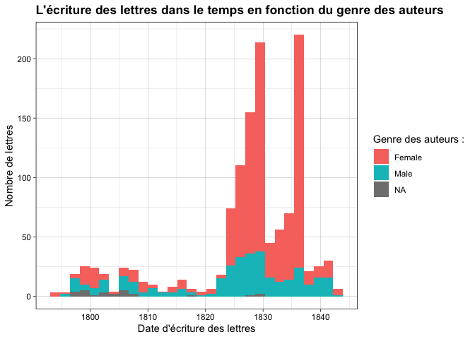

Correspondance de Constance de Salm
================
26 novembre 2021

-   [Quelques leçons de la tentative d’OCRisation de la
    correspondance](#quelques-leçons-de-la-tentative-docrisation-de-la-correspondance)
-   [Enrichissement de la base de
    données](#enrichissement-de-la-base-de-données)
-   [Analyse de l’utilisation des rédacteurs par Constance de
    Salm](#analyse-de-lutilisation-des-rédacteurs-par-constance-de-salm)
    -   [Constance de Salm et ses différents rédacteurs dans le
        temps](#constance-de-salm-et-ses-différents-rédacteurs-dans-le-temps)
    -   [Le genre des auteurs des lettres en fonction des rédacteurs de
        Constance de
        Salm](#le-genre-des-auteurs-des-lettres-en-fonction-des-rédacteurs-de-constance-de-salm)
    -   [L’évolution dans le temps du genre des auteurs des
        lettres](#lévolution-dans-le-temps-du-genre-des-auteurs-des-lettres)
-   [Réseaux](#réseaux)
-   [Analyse lexicale](#analyse-lexicale)

## Quelques leçons de la tentative d’OCRisation de la correspondance

Le modèle d'HTR à disposition ne suffit pas à obtenir une sortie texte satisfaisante à partir des documents du corpus sur lequel il n'a pas été entraîné. Cette insuffisance doit être attribuée à la taille restreinte du corpus d'entraînement.

En revanche, la sortie texte est satisfaisante et peut être corrigée avec un module python pour les documents sur lesquels le modèle a été entraîné ou dont les caractéristiques graphologiques sont très proches.

À défaut de pouvoir traiter efficacement la totalité du sous-corpus que nous avions défini au début du datathon, nous avons choisi d'enrichir le corpus gold (le corpus d'entraînement du modèle) en créant de nouveaux fichiers xml d'entraînement sur un échantillon aléatoire et plus large. Nous souhaitons que notre échec puisse servir à un futur projet d'océrisation du corpus, en commençant par développer un modèle robuste capable de transcrire toutes les mains des registres de lettre de Constance de Salm.

## Enrichissement de la base de données

&lt;p style=“text-align:justify;”&gt;Suite à l’échece de l’OCRisation
via Kraken et eScriptorium, nous avons changé le critère de réduction de
notre corpus de lettres. À l’origine, nous nous étions concentré·es sur

&lt;/p&gt;

|  id | main\_num | Verfasser                                                                | Verfasser\_1genre | Verfasser\_2genre | Empfänger                                                                        | Empfänger1genre | Datierung..JJJJ.MM.TT. | Schlagwörter                                                                                                   |
|----:|:----------|:-------------------------------------------------------------------------|:------------------|:------------------|:---------------------------------------------------------------------------------|:----------------|:-----------------------|:---------------------------------------------------------------------------------------------------------------|
|   1 | main1     | Salm, Constance de (CdS)                                                 | Female            | Female            | Pailliet, Jean Baptiste Joseph (Anwalt der CdS in Orléans, um 1829)              | Female          | 1841-11-09             | CdS: Œuvres complètes (1842); Tod/Trauer; CdS: Vierbändige Werkausgabe (1835/1836), 2 Prosa- und 2 Poesiebände |
|   2 | main1     | Carrion de Nisas, Henri de, baron                                        | Male              | NA                | Salm, Constance de (CdS)                                                         | Female          | 1810-05-22             | CdS: Cantate sur le mariage de Sa Majesté l’Empereur (1810)                                                    |
|   3 | main1     | Girodet-Trioson, Anne-Louis, eigentl. Girodet de Roussy                  | Female            | NA                | Salm, Constance de (CdS)                                                         | Female          | 1817-05-20             | NA                                                                                                             |
|   4 | main1     | Salm, Constance de (CdS)                                                 | Female            | Female            | Pailliet, Jean Baptiste Joseph (Anwalt der CdS in Orléans, um 1829)              | Female          | 1829-06-03             | Wirtschaft/Finanzen; Prozess/Gericht                                                                           |
|   5 | main1     | Marchangy, Louis Antoine François Émilien (Ehekandidat 1812 für Minette) | Male              | NA                | Martini, Jean Paul Égide, eigentl. Johann Paul Ägidius Martin bzw. Schwarzendorf | Female          | NA                     | NA                                                                                                             |
|   6 | main1     | Dufresnoy, Adélaïde-Gillette, geb. Billet                                | Female            | Female            | Salm, Constance de (CdS)                                                         | Female          | 1811-01-28             | Briefpartner/Werk                                                                                              |

## Analyse de l’utilisation des rédacteurs par Constance de Salm

### Constance de Salm et ses différents rédacteurs dans le temps

Maintenant que les quatre différentes mains ayant rédigées les lettres
ont été identifiées et l’information ajoutée dans une variable de notre
base de données, on peut regarder l’évolution dans le temps du recours
par Constance de Salm à ses différents rédacteurs de lettre. On observe
ainsi que la main 1 est celle qui rédige sur le temps le plus long la
correspondance de Constance de Salm depuis 1793 jusque 1842. C’est ce
rédacteur qui a ainsi sur notre corpus été le rédacteur de presque la
moitié des lettres 587 d’entre elles, soit 40%. Le deuxième rédacteur le
plus employé par Constance de Salm avec 412 lettres rédigées est la main
4.

|       |   n |    % | val% |
|:------|----:|-----:|-----:|
| main1 | 587 | 40.0 | 40.0 |
| main2 | 271 | 18.5 | 18.5 |
| main3 | 196 | 13.4 | 13.4 |
| main4 | 412 | 28.1 | 28.1 |

### Le genre des auteurs des lettres en fonction des rédacteurs de Constance de Salm

Lorsque l’on regarde par rédacteur le genre des auteurs, on observe des
différences intéressantes. Tandis que la main 1 a une majorité d’auteurs
masculins, les autres mains ont en majorité des autrices.

### L’évolution dans le temps du genre des auteurs des lettres

Dans les pics de correspondance de Constance de Salm, on voit que les
femmes restent majoritaire en tant qu’autrices des lettres.

## Réseaux

### Sondage

Nous avons choisi une main pour réduire notre corpus. Qu'est-ce qui caractérise cette partie du corps ?

Data: https://github.com/ElodieXVI/Datathon-Constance-de-Salm/blob/main/Donnees_Lettres/Constance_de_Salm_Special_lettres.csv

Timeline ([Palladio](http://hdlab.stanford.edu/palladio/)). Période intéressante, deuxième mariage, carrière:

Qui fait partie du réseau au plus fort de l'activité, c'est principalement le frère et les avocats ([Palladio](http://hdlab.stanford.edu/palladio/)):

On voit (dans la colonne points clés "inhaltliche Schlagwörter") pour ce corpus sélectionné qu'il s'agit principalement de conflits de Constance de Salm avec la famille Pipelet (son premier mariage) pour des questions d'héritage.

### Exemple d'application des données enrichies et divisées

1. Importation vers [Palladio](http://hdlab.stanford.edu/palladio/)

2. Graph du réseau : Source: auteur "Verfasser" et Target: destinataire "Empfänger"

    Filtré par timeline, dimension "Datierung"

    Et avec des facettes :  Main, sexe, mot-clé "Schlagwort", lieu "Ausstellungsort"

3. Carte

Dimension: lieux de création "Ausstellungsort"

Facette : ligne de temps, auteur

## Analyse lexicale

 On a décidé d'utiliser toute les premières phrases des lettres pour l'analyse. Après qu'on a fait la prépraration lexicale pour permettre une analyse plus élaborée, on a utilisé la bibliothèque TextBlob pour déterminer le sentiment de chaque phrase.

Les résultats montrent que le ton général dans le jeu de données est positif. Bien sûr, il faudrait le verifier.

Pour permettre une référence, on a aussi faire une analyse de sentiment d'œuvre "Vingt quatre heures d'une femme sensible". Ici, le ton et plus neutre.

