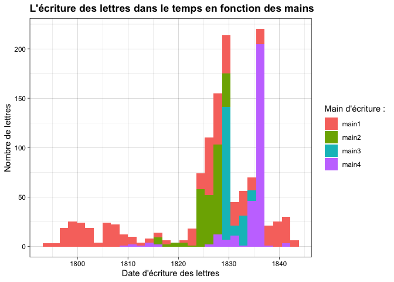
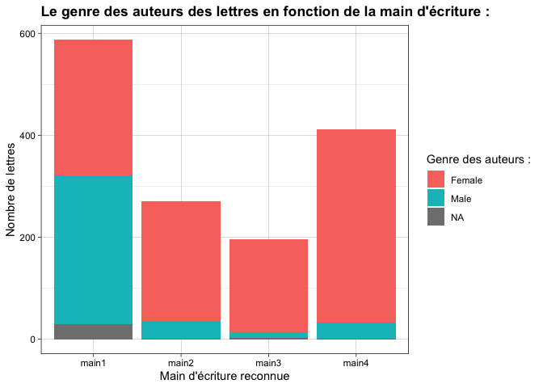

Correspondance de Constance de Salm
================
25 novembre 2021

-   [Constance de Salm et ses différents rédacteurs dans le
    temps](#constance-de-salm-et-ses-différents-rédacteurs-dans-le-temps)
-   [Le genre des auteurs des lettres en fonction des rédacteurs de
    Constance de
    Salm](#le-genre-des-auteurs-des-lettres-en-fonction-des-rédacteurs-de-constance-de-salm)
-   [L’évolution dans le temps du genre des auteurs des
    lettres](#lévolution-dans-le-temps-du-genre-des-auteurs-des-lettres)
-   [La première ligne des lettres du corpus de Constance de
    Salm](#la-première-ligne-des-lettres-du-corpus-de-constance-de-salm)
-   [La première ligne des lettres de Constance de
    Salm](#la-première-ligne-des-lettres-de-constance-de-salm)

### Constance de Salm et ses différents rédacteurs dans le temps

Maintenant que les quatre différentes mains ayant rédigées les lettres
ont été identifiées et l’information ajoutée dans une variable de notre
base de données, on peut regarder l’évolution dans le temps du recours
par Constance de Salm à ses différents rédacteurs de lettre. On observe
ainsi que la main 1 est celle qui rédige sur le temps le plus long la
correspondance de Constance de Salm depuis 1793 jusque 1840. C’est ce
rédacteur qui a ainsi sur notre corpus été le rédacteur de presque la
moitié des lettres 587 d’entre elles, soit 40%. Le deuxième rédacteur le
plus employé par Constance de Salm avec 412 lettres rédigées est la main
4.

|       |   n |    % | val% |
|:------|----:|-----:|-----:|
| main1 | 587 | 40.0 | 40.0 |
| main2 | 271 | 18.5 | 18.5 |
| main3 | 196 | 13.4 | 13.4 |
| main4 | 412 | 28.1 | 28.1 |

### Le genre des auteurs des lettres en fonction des rédacteurs de Constance de Salm

Lorsque l’on regarde par rédacteur le genre des auteurs, on observe des
différences intéressantes. Tandis que la main 1 a une majorité d’auteurs
masculins, les autres mains ont en majorité des autrices.

### L’évolution dans le temps du genre des auteurs des lettres

Dans les pics de correspondance de Constance de Salm, on voit que les
femmes restent majoritaire en tant qu’autrices des lettres.

### La première ligne des lettres du corpus de Constance de Salm

J’ai réalisé un nuage de mots et regardé les mots employés les plus
fréquemment dans la première ligne des lettres du corpus.

|           | Global occ. |  Global % |
|:----------|------------:|----------:|
| monsieur  |         668 | 5.3857938 |
| lettre    |         407 | 3.2814642 |
| madame    |         364 | 2.9347738 |
| chère     |         246 | 1.9833911 |
| reçu      |         220 | 1.7737644 |
| sœur      |         167 | 1.3464484 |
| bien      |         162 | 1.3061356 |
| cher      |         137 | 1.1045715 |
| depuis    |         116 | 0.9352576 |
| écrire    |         106 | 0.8546319 |
| hier      |          98 | 0.7901314 |
| frère     |          97 | 0.7820689 |
| si        |          97 | 0.7820689 |
| jours     |          94 | 0.7578812 |
| plus      |          90 | 0.7256309 |
| avoir     |          87 | 0.7014432 |
| dire      |          87 | 0.7014432 |
| fait      |          86 | 0.6933806 |
| bonne     |          84 | 0.6772555 |
| veux      |          82 | 0.6611304 |
| répondre  |          77 | 0.6208175 |
| princesse |          75 | 0.6046924 |
| amie      |          74 | 0.5966298 |
| paris     |          70 | 0.5643796 |
| temps     |          67 | 0.5401919 |

### La première ligne des lettres de Constance de Salm

J’ai extrait les premières des lettres de Constance de Salm pour
visualiser si son nuage de mots est différent de celui du reste du
corpus.

